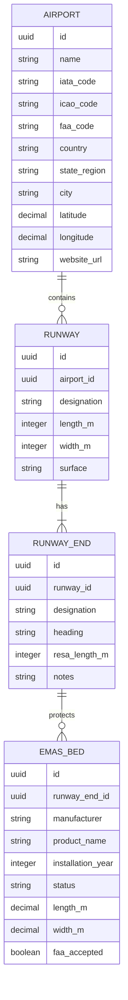
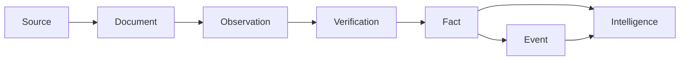
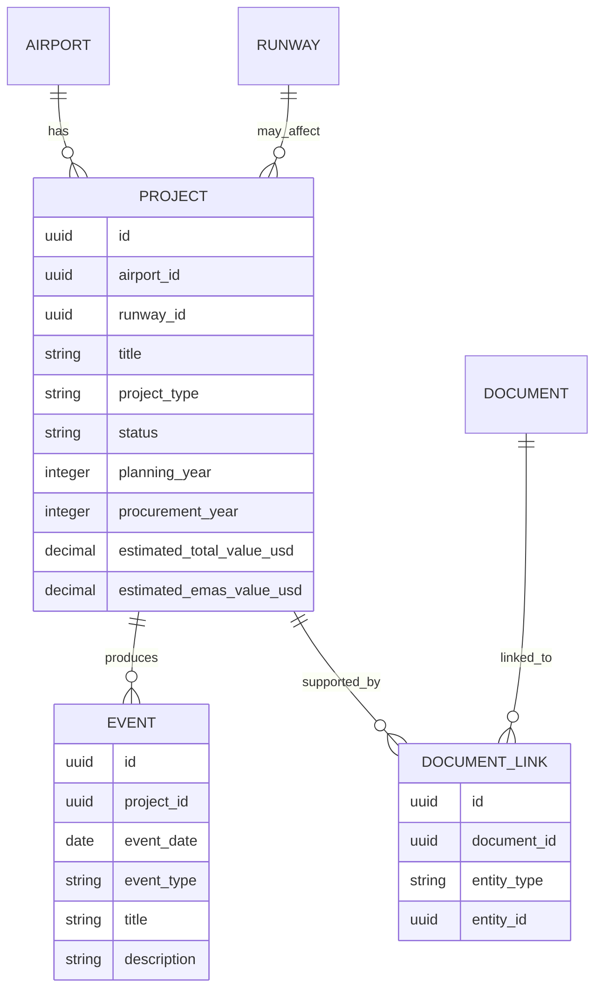

# RWI Domain Model

This document describes the initial domain model for RWI.

The model is intentionally small enough to start building. It will evolve through migrations and documented architecture decisions.

## Airport Infrastructure

## Knowledge Flow

## Project Relationships

## Initial Build Scope

Sprint 1 will implement only:

- Airport
- Runway
- Runway End
- EMAS Bed
- Project
- Source
- Document

Observation, Fact, Verification and Intelligence will be designed later, after the basic CRUD and import workflow work correctly.

## Design Rule

Design enough to start building. Then build.